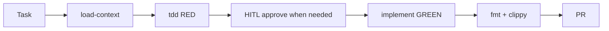
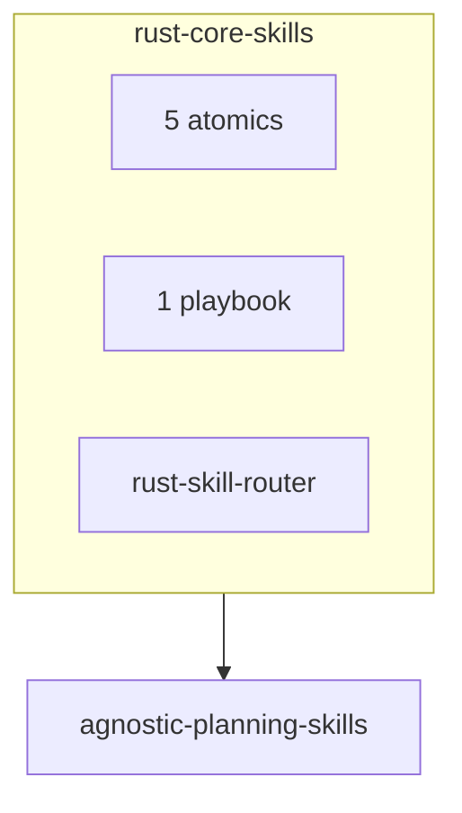

# Rust Core Skills

This file is the host-context source of truth. `CLAUDE.md` and `GEMINI.md` point here.

Human catalog: [README.md](README.md). Layout: [docs/architecture.md](docs/architecture.md). FP: [docs/fcis-rust.md](docs/fcis-rust.md).

## Tests gate implementation

Implementation waits until a test exists, has been run, and fails because the behaviour is missing — not because of a compile error you have not fixed in the test. Wrote code first? Delete it and start over.

```text
load-context (existing crate) → failing test → confirm RED
  → propose implementation → wait for approval when authority is not already granted → implement → confirm GREEN
  → cargo fmt --check → cargo clippy --all-targets -- -D warnings → cargo test
```

## Daily loop





PRDs, tickets, sprints: stop and use `agnostic-planning-skills`. Do not implement product code in this repo’s skills.

## When to load a skill

Read the matching `SKILL.md` before acting. Descriptions are triggers only — the body is the procedure. Do not invent skill names; use `directory.json`.

| Skill | Use when |
|-------|----------|
| `load-context` | Existing crate. Read `Cargo.toml`, toolchain, one neighbor + its test. |
| `rust-essentials` | Any `.rs` write. FCIS, ponytail ladder, parse-at-boundary. |
| `ownership-borrowing` | Clone, lifetimes, Arc/Rc, interior mutability. |
| `type-driven-design` | Newtypes, enum state, typestate, `TryFrom` at the boundary. |
| `error-handling` | `Result`, `?`, thiserror/anyhow, unwrap on recoverable errors. |
| `tdd` | New or changed behaviour. RED → approval or prior authorization → GREEN → quality gate. |
| `rust-skill-router` | Unclear next skill. First line: `Next skill: skills/<name>`. Does not implement. |

Planned IDs in [docs/topic-inventory.md](docs/topic-inventory.md) are **not written**. Do not route to them.

## Hard gates (never skip)

1. **Read the skill before applying it.** Match on frontmatter `name` / `description`, then load full `SKILL.md`.
2. **Honor HARD-GATE blocks** inside each skill. Do not proceed past an approval gate without an explicit user signal or authorization already granted for this task.
3. **English artifacts** unless the user explicitly requests another language.
4. **No machine paths.** Skills must not mention `/Users/`, `/home/`, `C:\`, or vaults.
5. **`directory.json` is the registry.** Only keys there are loadable.

## Repository layout

```text
.
├── AGENTS.md                 # This file (agent operating manual)
├── CLAUDE.md                 # Thin stub → AGENTS.md
├── GEMINI.md                 # Thin stub → AGENTS.md
├── directory.json            # Canonical skill registry
├── skills.sh.json            # skills.sh groupings (display only)
├── skills/<name>/SKILL.md    # Flat layout
├── docs/                     # FCIS, architecture, catalog, playbooks
├── bin/                      # Bundled rs-guard
├── hooks/                    # pre-commit-rs-guard (advisory)
└── .github/                  # review-prompt.md, CI workflows
```

No root `SKILL.md`. Display groups: `skills.sh.json`.

## Skill descriptions

`description` says when to use the skill and lists trigger words. It does not restate the procedure. Target ≤ 600 characters. Spec hard limit is 1024.

See [docs/architecture.md](docs/architecture.md) and [docs/skill-authoring.md](docs/skill-authoring.md).

## Validation

Before commit:

```bash
python3 -m json.tool directory.json > /dev/null
python3 -m json.tool skills.sh.json > /dev/null

git add <files>
git diff --cached --unified=5 > /tmp/staged.diff
rs-guard --diff-file /tmp/staged.diff --rules-file .github/review-prompt.md --dry-run --model deepseek-v4-flash
```

CI installs rs-guard 1.8.0 via `scripts/rs-guard-install.sh`. Pre-commit: `hooks/pre-commit-rs-guard` (advisory).

Written skills only in `directory.json`. Atomics prefer < 120 lines; playbooks < 160.

## Out of scope here

Do not edit `agnostic-planning-skills`, `ruby-core-skills`, `rails-agent-skills`, or `elixir-phoenix-skills` from this canvas. Runtime pack registration is a follow-up in `agent-mcp-runtime`.
